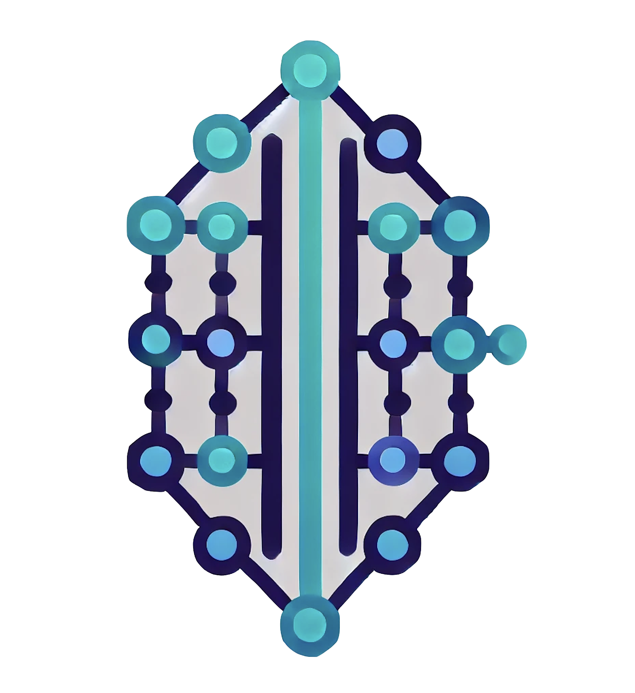

  <small>Join the project community on our server!</small>
    
  

    

**Yggdrasill is an Automaton tool that executes defined tasks or tasks customized and created by the user through LLM.**
It automatically updates prompts in response to actions.
They are computed from inferences consisting of multiple previous actions.
- Automated problem resolve
- User defined task
- Works any LLM

**Runetale can be used to scale this Automaton more securely.**
- Communication between Yggdrasill engine
- Secure user defined task remote auto-execution using Runetale

## LLM Support

## Example

## Future
- [ ] Support Rag Model
- [ ] Create a system that allows you to Serving Yggdrasill
- [ ] Native Intergation with Runetale